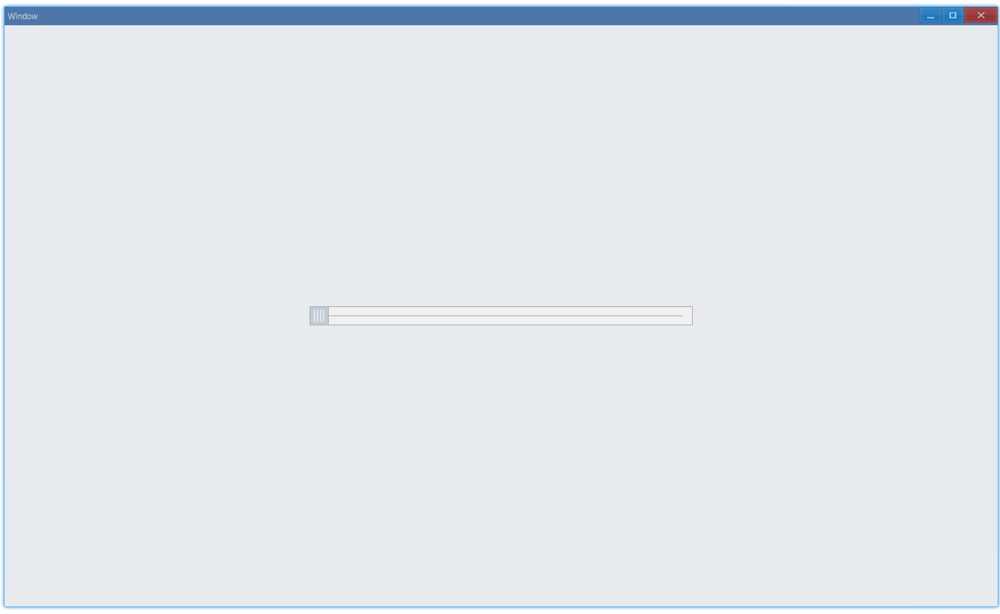

<!-- ## 简介 {#introduction}

TODO：以后添加对轨道条的整体介绍。 -->

## 例子 {#examples}

### 基本用法 {#example-basic}

```ts {4-7}
import { Window, TrackBar } from 'ave-ui';

export function main(window: Window) {
    const trackBar = new TrackBar(window);
    trackBar.OnThumbRelease((sender) => {
        console.log(`on thumb release, current value: ${sender.GetValue()}`);
    });

    const container = getControlDemoContainer(window, 1, 500, 25);
    container.ControlAdd(trackBar).SetGrid(1, 1);
    window.SetContent(container);
}
```

在这个例子中，我们演示了轨道条的基本用法：拖动滑块以获取对应位置的值:



同时控制台还有类似这样的输出：

```bash
on thumb release, current value: 0
on thumb release, current value: 22
on thumb release, current value: 46
on thumb release, current value: 69
on thumb release, current value: 75
on thumb release, current value: 85
on thumb release, current value: 100
...
```

#### API {#api-basic}

```ts
export interface ITrackBar extends IControl {
    // 获取滑块当前位置值，默认范围是[0,100]
    GetValue(): number;
    SetValue(nValue: number): TrackBar;

    // 设置一个回调，在拖动滑块放手的时候调用
    OnThumbRelease(fn: (sender: TrackBar) => void): TrackBar;
}
```
