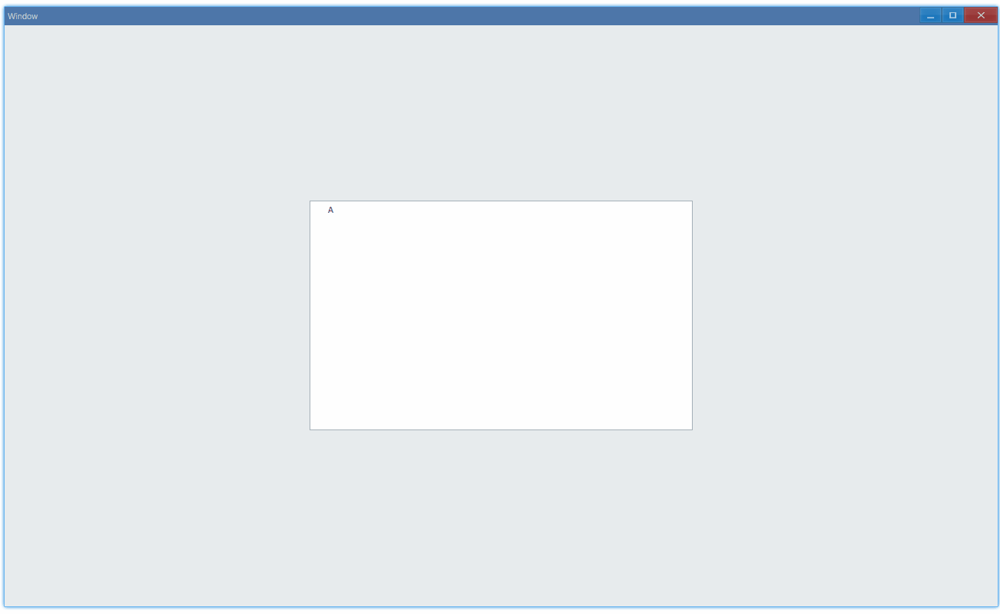

<!-- ## 简介 {#introduction}

TODO：以后添加对树形控件的整体介绍。 -->

## 例子 {#examples}

### 基本用法 {#example-basic}

```ts {10-15,33,26,18}
import {
    Window,
    Tree,
    TreeInsert,
    TreeGenericHandle,
    TreeItemFlag,
} from 'ave-ui';

export function main(window: Window) {
    const tree = new Tree(window);
    tree.OnSelectionChange((sender) => {
        const handler = sender.ItemGetSelection();
        const treeItem = sender.ItemGet(handler);
        console.log(`select ${treeItem.Text}`);
    });

    const A = new TreeInsert();
    A.Parent = TreeGenericHandle.Root;
    A.After = TreeGenericHandle.Last;
    A.Item.Flag = TreeItemFlag.Text;
    A.Item.Text = 'A';
    const handlerA = tree.ItemInsert(A);

    const B = new TreeInsert();
    B.Parent = handlerA;
    B.After = TreeGenericHandle.Last;
    B.Item.Flag = TreeItemFlag.Text;
    B.Item.Text = 'B';
    tree.ItemInsert(B);

    const C = new TreeInsert();
    C.Parent = handlerA;
    C.After = TreeGenericHandle.First;
    C.Item.Flag = TreeItemFlag.Text;
    C.Item.Text = 'C';
    const handlerC = tree.ItemInsert(C);

    const D = new TreeInsert();
    D.Parent = handlerC;
    D.After = TreeGenericHandle.Last;
    D.Item.Flag = TreeItemFlag.Text;
    D.Item.Text = 'D';
    tree.ItemInsert(D);

    const container = getControlDemoContainer(window, 1, 500, 300);
    container.ControlAdd(tree).SetGrid(1, 1);
    window.SetContent(container);
}
```

在这个例子中，我们演示了树形控件的基本用法：显示一系列节点并响应点击事件:



同时控制台还有以下输出：

```bash
select A
select C
select D
select B
```

#### API {#api-basic}

```ts
export interface ITree extends IControl {
    // 插入节点
    ItemInsert(pInsert: TreeInsert): TreeItemHandle;

    // 获取节点，使用插入时返回的handler
    ItemGet(pItem: TreeItemHandle): TreeItem;
    // 获取当前选中的节点的handler
    ItemGetSelection(): TreeItemHandle;

    OnSelectionChange(fn: (sender: Tree) => void): Tree;
}

// 描述插入的节点
export class TreeInsert {
    // 指定父节点
    Parent: TreeItemHandle = 0;
    // 描述排序相关的
    After: TreeItemHandle = 0;
    // 实际树节点数据
    Item: TreeItem = new TreeItem();
}

// 内置的节点handler
export class TreeGenericHandle {
    // 根节点
    static get Root(): TreeItemHandle;
    // 描述排序相关的
    // First: 将此节点排在第一个
    // Last: 将此节点排在最后一个
    static get First(): TreeItemHandle;
    static get Last(): TreeItemHandle;
    static get Sort(): TreeItemHandle;
}

export class TreeItem {
    Flag: TreeItemFlag = TreeItemFlag.None;
    Icon: IconCache = 0;
    // 节点文本内容
    Text: string = '';
    Item: TreeItemHandle = 0;
    Blank: boolean = false;
}
```
