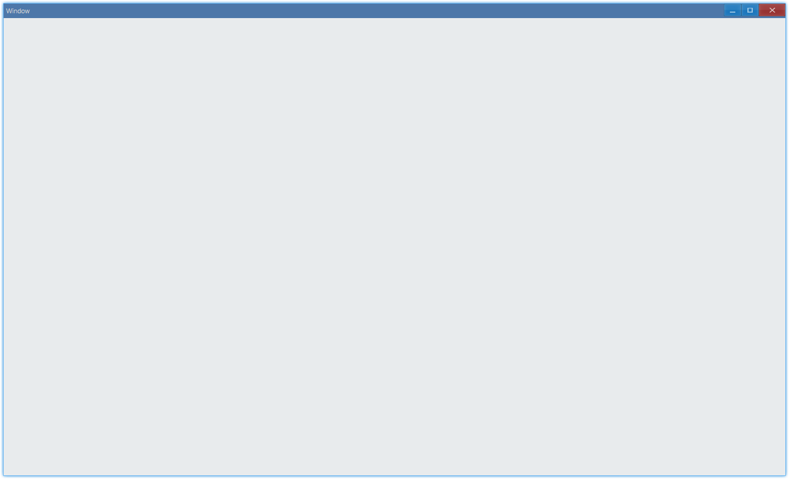
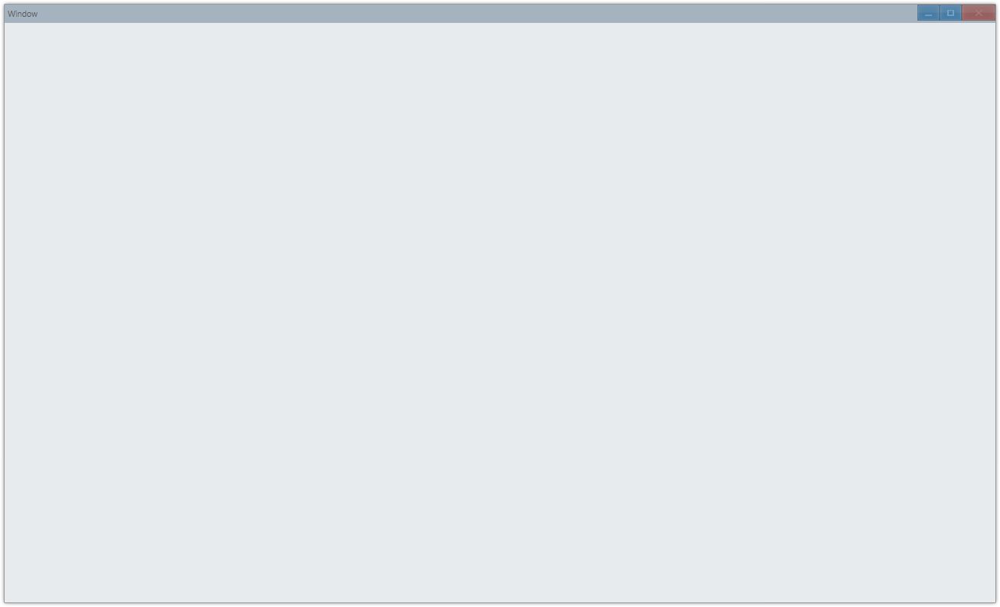
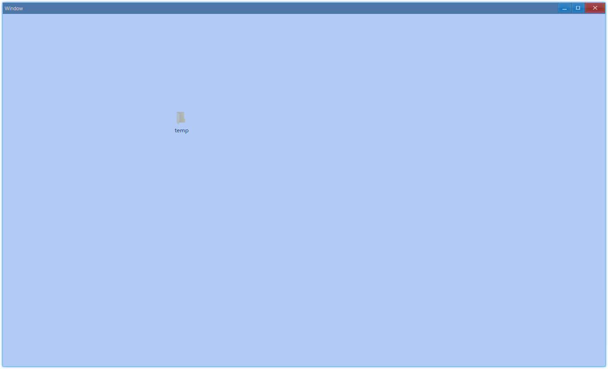

<!-- ## 简介 {#introduction}

TODO：以后添加对窗口的说明 -->

## 例子 {#examples}

### 基本窗口 {#example-window-basic}

```ts
import { App, WindowCreation, WindowFlag, Window } from 'ave-ui';

// 首先需要创建ave app，并将它挂在globalThis上，目的是防止gc
const app = new App();
globalThis.app = app;

// cp：creation param
// 创建窗口需要的一些设置
const cpWindow = new WindowCreation();
cpWindow.Title = 'Window';
cpWindow.Flag |= WindowFlag.Layered;

// 同样，创建的window对象也需要挂在globalThis上
const window = new Window(cpWindow);
globalThis._window = window;

// 设置回调，窗口内的内容在这个回调中创建
window.OnCreateContent((sender) => {
    return true;
});

// 实际去创建系统窗口
if (!window.CreateWindow()) process.exit(-1);

// 设置窗口可见且处于激活状态
window.SetVisible(true);
window.Activate();
```

运行之后会弹出这样的窗口：



#### API {#api-window-basic}

```ts
export interface IWindow extends IControl {
    // 设置创建窗口内容的回调
    // callback：如果创建成功返回true，否则返回false（这样不会弹出窗口）
    OnCreateContent(callback: (sender: Window) => boolean): Window;

    // 实际去创建系统窗口，成功返回true，失败返回false
    CreateWindow(): boolean;

    // 设置窗口是否可见，返回窗口本身，方便链式调用
    SetVisible(visible: boolean): IControl;

    // 激活窗口，未激活的窗口是灰色的
    Activate(): Window;

    // 设置窗口是否有背景
    SetBackground(useBackground: boolean): Window;
}

export class WindowCreation {
    Title: string = '';
    Flag: WindowFlag = WindowFlag.Default;
}

export enum WindowFlag {
    MainWindow /**/ = 0x00000001, // 带有这个标志的窗口关闭之后会导致程序退出
    Sizable /**/ = 0x00000004, // 可调节大小
    Minimum /**/ = 0x00000008, // 可最小化
    Layered /**/ = 0x00000040, // 窗口可以显示半透明
    Default /**/ = MainWindow | Sizable | Minimum,
}
```

未激活的窗口：



### 半透明窗口 {#example-window-opacity}

`Layered`模式的窗口支持半透明，比如想要这样的效果：



代码中可以这样实现：

```ts {24,33}
import {
    App,
    WindowCreation,
    WindowFlag,
    Window,
    Grid,
    Vec4,
    DockMode,
} from 'ave-ui';

export function run() {
    const app = new App();
    globalThis.app = app;

    const cpWindow = new WindowCreation();
    cpWindow.Title = 'Window';
    cpWindow.Flag |= WindowFlag.Layered;

    const window = new Window(cpWindow);
    globalThis._window = window;

    window.OnCreateContent((sender) => {
        // 设置window不要背景，默认是白色背景
        sender.SetBackground(false);

        const grid = new Grid(sender);
        {
            const gridChild = new Grid(sender);
            grid.ControlAdd(gridChild).SetDock(DockMode.Fill);
            const color = new Vec4(100, 149, 237, 255);
            gridChild.SetBackColor(color);
            // gridChild的透明度就将是窗口（内容）的透明度
            gridChild.SetOpacity(0.5);
        }
        window.SetContent(grid);
        return true;
    });

    if (!window.CreateWindow()) process.exit(-1);

    window.SetVisible(true);
    window.Activate();
}
```

关于 grid 透明度，见：[半透明 Grid](layout#example-grid-opacity)。
